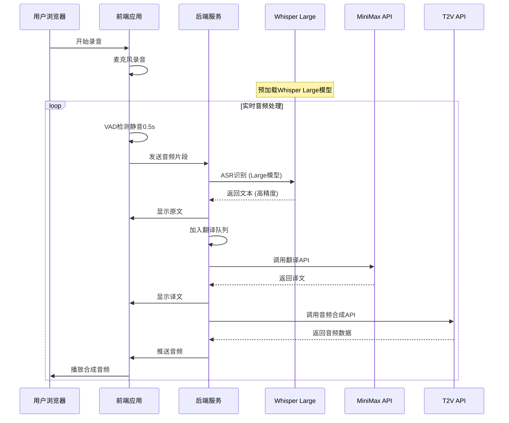
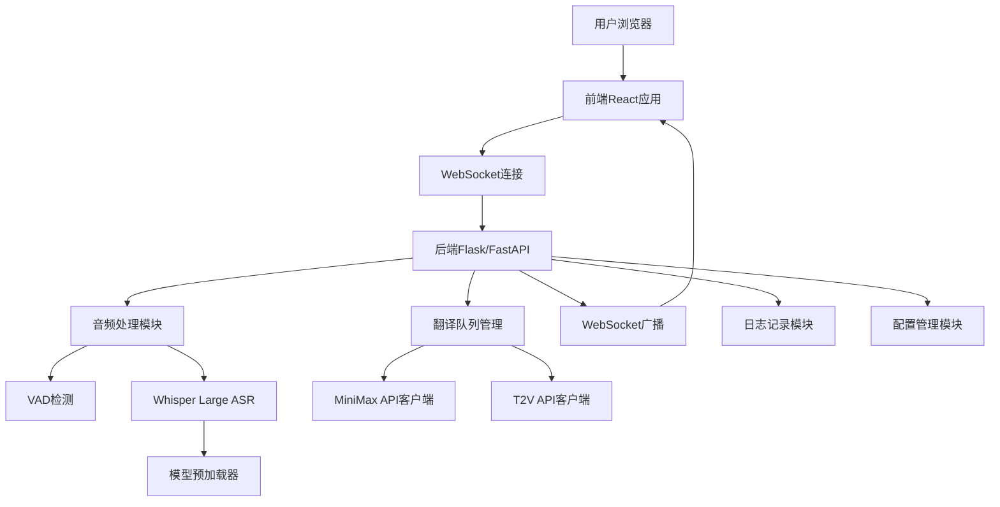

# 同声传译系统 - 产品需求文档 (PRD)

## 📋 产品路线图 (Product Roadmap)

### 核心目标 (Mission)
打造一个基于本地部署的实时同声传译系统，为用户提供低延迟、高质量的语音翻译服务。

### 用户画像 (Persona)
- **目标用户**：需要实时翻译的个人用户（会议、学习、交流场景）
- **核心痛点**：现有翻译工具延迟高、准确性差、依赖第三方服务
- **技术水平**：能够配置API密钥，基本的技术操作能力

### V1: 最小可行产品 (MVP)
- ✅ 浏览器麦克风录音功能
- ✅ Whisper Large模型本地ASR自动语言识别
- ✅ VAD语音活动检测（0.5秒静音触发）
- ✅ MiniMax API文本翻译
- ✅ t2v API语音合成
- ✅ 实时播放合成音频
- ✅ 用户配置界面（API Key、Voice ID、目标语言选择）
- ✅ 原文+译文实时显示
- ✅ 会话级历史记录
- ✅ 错误日志显示
- ✅ 基础排队处理机制
- ✅ HTTPS协议支持

### V2 及以后版本 (Future Releases)
- 🔄 持久化历史记录存储
- 🔄 音频质量设置选项
- 🔄 多种语音选择界面
- 🔄 翻译结果手动纠错功能
- 🔄 音频导出功能
- 🔄 多用户会话支持
- 🔄 实时翻译准确度优化
- 🔄 界面美化和用户体验提升
- 🔄 移动端适配
- 🔄 GPU加速优化

### 关键业务逻辑 (Business Rules)
1. **音频处理流程**：录音 → VAD检测 → 分片 → Whisper Large识别 → 队列处理
2. **翻译流程**：文本 → MiniMax翻译 → t2v合成 → 音频播放
3. **错误处理**：API失败记录日志，继续处理下一个片段
4. **队列管理**：最多3个待处理项，超时8秒自动丢弃（考虑Large模型延迟）

### 数据契约 (Data Contract)
- **输入**：实时音频流、API密钥、Voice ID、目标语言
- **处理**：音频分片、文本识别、翻译文本、合成音频
- **输出**：原文文本、译文文本、合成音频、操作日志

## 🎨 选定的MVP界面原型

### 方案B：对话气泡布局（聊天导向）
```
┌─────────────────────────────────────────────────────────┐
│  同声传译 | API: [________] Voice: [___] Lang: [EN▼] ●REC │
├─────────────────────────────────────────────────────────┤
│                                                         │
│  ┌──────────────────────────┐                          │
│  │ 你好，我想咨询一个问题    │ [原文]                    │
│  └──────────────────────────┘                          │
│                          ┌──────────────────────────────┐│
│                          │ Hello, I want to ask a       ││
│                          │ question [译文] ♪           ││
│                          └──────────────────────────────┘│
│                                                         │
│  ┌──────────────────────────┐                          │
│  │ 关于产品的价格和功能      │ [原文]                    │
│  └──────────────────────────┘                          │
│                          ┌──────────────────────────────┐│
│                          │ About product pricing and    ││
│                          │ features [译文] ♪ 处理中...  ││
│                          └──────────────────────────────┘│
│                                                         │
├─────────────────────────────────────────────────────────┤
│ 状态: 队列1个 | 日志: API调用成功 | [清空] [导出]        │
└─────────────────────────────────────────────────────────┘
```

### 设计特点
- **对话体验**：原文气泡在左，译文气泡在右，模拟对话场景
- **实时状态**：顶部显示配置信息和录音状态
- **处理反馈**：译文气泡显示处理状态（♪ 音频播放中、处理中...）
- **简洁操作**：底部状态栏显示队列状态和基础操作

## 🏗️ 架构设计蓝图

### 核心流程图



### 系统架构图



### 组件交互说明

#### 现有文件依赖
- `translate.txt` → 集成为 `翻译API客户端模块`
- `t2v.txt` → 集成为 `音频合成API客户端模块`

#### 新增核心模块

**前端组件**
- `ChatInterface.jsx` - 对话气泡界面
- `AudioRecorder.jsx` - 音频录制组件
- `ConfigPanel.jsx` - 配置面板
- `WebSocketClient.js` - WebSocket通信

**后端模块**
- `app.py` - 主服务入口
- `audio_processor.py` - 音频处理（VAD + Whisper Large）
- `translation_queue.py` - 翻译队列管理
- `api_clients/minimax_client.py` - 基于translate.txt
- `api_clients/t2v_client.py` - 基于t2v.txt
- `websocket_handler.py` - WebSocket事件处理
- `whisper_service.py` - Whisper Large模型服务

#### 调用关系链
```
用户录音 → AudioRecorder → WebSocket → audio_processor
→ whisper_service(Large) → translation_queue → [minimax_client, t2v_client]
→ websocket_handler → ChatInterface
```

### 技术选型与风险

#### 核心技术栈
- **前端**: React + WebSocket + Web Audio API
- **后端**: Python FastAPI + WebSocket + asyncio
- **音频**: Whisper Large + VAD (webrtcvad/silero-vad)
- **部署**: HTTPS (Let's Encrypt/自签名证书)

#### 关键风险预判

1. **性能风险 (Whisper Large)**
   - **风险**: Large模型处理延迟更高，内存占用大
   - **缓解**: 模型预加载 + 批处理优化 + GPU加速(可选)

2. **实时性风险**
   - **风险**: Whisper Large + API调用延迟可能超过用户期望
   - **缓解**: 队列超时延长至8秒 + 本地VAD优化

3. **内存风险**
   - **风险**: Whisper Large需要约3GB内存
   - **缓解**: 系统要求说明 + 内存监控

4. **音频质量风险**
   - **风险**: 浏览器麦克风质量影响ASR准确度
   - **缓解**: 音频预处理 + 噪音抑制

5. **API稳定性风险**
   - **风险**: MiniMax/T2V API调用失败或限流
   - **缓解**: 重试机制 + 降级策略

6. **WebSocket连接风险**
   - **风险**: 长时间连接可能断开
   - **缓解**: 自动重连 + 心跳检测

7. **HTTPS部署风险**
   - **风险**: 本地HTTPS证书配置复杂
   - **缓解**: 提供自动化脚本 + 详细文档

### 系统要求

#### 最低配置
- **RAM**: 8GB (推荐16GB)
- **存储**: 10GB可用空间
- **CPU**: 4核心 (推荐8核心)
- **GPU**: 可选，支持CUDA加速

#### 推荐配置
- **RAM**: 16GB+
- **GPU**: NVIDIA GTX 1660或更高
- **CPU**: 8核心+
- **网络**: 稳定的互联网连接（API调用）

## 📅 开发里程碑

### Phase 1: 基础架构 (Week 1)
- 搭建前后端框架
- 实现WebSocket通信
- 集成Whisper Large模型预加载

### Phase 2: 核心功能 (Week 2)
- 实现VAD音频分片
- 集成翻译和音频合成API
- 基础队列管理（8秒超时）

### Phase 3: 用户界面 (Week 3)
- 实现对话气泡界面
- 配置面板和状态显示
- 错误处理和日志

### Phase 4: 优化测试 (Week 4)
- 性能调优（Whisper Large优化）
- HTTPS部署
- 端到端测试
- 系统要求验证

---

**文档状态**: 已确认并锁定
**创建时间**: 2025-10-16
**版本**: v1.0 (Whisper Large)
**下一步**: 等待开发实施指令